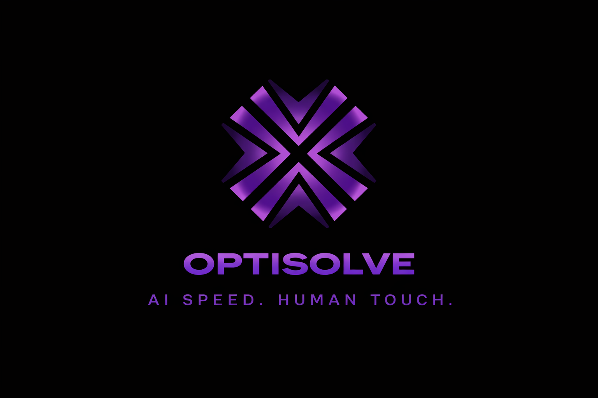

<div align="center">
  
  <h1>OptiSolve</h1>
  <p><b>AI speed. Human touch.</b></p>
  <p><i>The support system that learns while it works — and works while it learns. Made by Kaveri, Jival, Inesh, Janya - Team codeforcers for ATOS SRIJAN 2026 </i></p>
</div>

---

demo link: https://drive.google.com/file/d/1ODCI-j1nPftBB69aMu3-EYH3kEsY4aDW/view?usp=sharing

## 🛑 The Problem
Every business has a support problem: too many tickets, not enough people, and customers waiting. Traditional support systems are inherently reactive. A ticket comes in. Someone reads it. Someone replies. Hours pass. Sometimes days. The customer is frustrated, the agent is overwhelmed, and the business is losing trust.

## 💡 The Solution
**OptiSolve** is an intelligent support orchestration system built to solve the modern inbox. It bridges the gap between full AI automation and necessary human judgment. 

When a user submits a support ticket, OptiSolve runs two analyses in parallel:
1. **RAG Pipeline:** It searches a vector knowledge base of past resolved tickets to find relevant solutions and generate a drafted reply using an LLM.
2. **Sentiment Analysis:** It assesses the emotional tone of the user's message (e.g., frustrated, distressed, neutral).

These two signals combine to form a **Confidence Score**, which drives our dynamic routing engine.

---

## ⚙️ Three-Tier Orchestration Logic
Not every ticket needs a human, and not every ticket should be automated. OptiSolve routes every incoming query into one of three tiers:

* **🟢 Tier 1: Auto-Resolution (Confidence > 85%)**
  The AI knows the answer and the user's sentiment is neutral. The system replies immediately. Ticket closed. No human intervention needed.
  
* **🟡 Tier 2: AI-Assisted Approval (Confidence 60-85%)**
  The AI drafts a high-quality response but lacks total certainty. A human agent receives the draft, reviews it, edits if necessary, and sends the final reply. *The AI does the heavy lifting; the human provides the final judgment.*
  
* **🔴 Tier 3: Full Escalation (Confidence < 60% OR High Frustration)**
  The issue is overly complex or the user is highly agitated. The ticket is immediately routed to a human specialist with a generated "Context Summary" and "Escalation Diagnostic."

---

## 🧠 The Empathy Engine & Learning Loop
OptiSolve doesn't just route tickets; it learns from them. 

Every time a human agent corrects an AI-drafted Tier 2 response, that correction goes through a quality gate. If the edit improves the solution, the system's vector database is updated. 

**Over time, the system gets smarter.** Issues that initially required human review (Tier 2) are confidently handled by the AI (Tier 1) within days. The more it's used, the better it gets—without manual model retraining. 

**Zero Cold-Start:** OptiSolve ships with a pre-seeded knowledge base for common industry issues (account access, billing, etc.), meaning it routes intelligently from minute one.

---

## 📊 Projected Impact
* **30-40% Reduction in MTTR:** Faster resolutions via pre-drafted Tier 2 responses.
* **20-30% Ticket Deflection:** Proactive resolution at the pre-submission layer.
* **Reduced Compassion Fatigue:** Agents focus on high-value problem solving, not repetitive typing.

---

## 🛠 Tech Stack
Built for prototype speed and enterprise scale using an Event-Driven Architecture.

* **Frontend:** React, Vite, Tailwind CSS (Real-time SPA with live polling and dynamic agent views).
* **Backend:** Python, FastAPI (Async request handling & native ML integration).
* **Databases:** PostgreSQL (Structured Metadata), ChromaDB / Pinecone (Vector Store).
* **AI Orchestrator:** LangChain.
* **LLMs & Models:** Gemini Pro / Llama 3 (Generation), Hugging Face Transformers / NLTK VADER (Sentiment).

---

## 🚀 Getting Started

### 1. Clone the Repository
```bash
git clone https://github.com/kaverii11/Optisolve.git
cd Optisolve/optisolve
```

### 2. Start the Backend (FastAPI)
Activate your virtual environment, install dependencies, and run the server:

```bash
# From the optisolve directory
source .venv/bin/activate  # On Windows use: .venv\Scripts\activate
pip install -r requirements.txt

# Run the backend
python -m uvicorn backend.main:app --reload

# The API will be available at http://localhost:8000
# View interactive docs at http://localhost:8000/docs
```

### 3. Start the Frontend (Vite + React)
In a new terminal window, navigate to the frontend directory:

```bash
cd frontend
npm install
npm run dev

# The app will be available at http://localhost:5173
```
