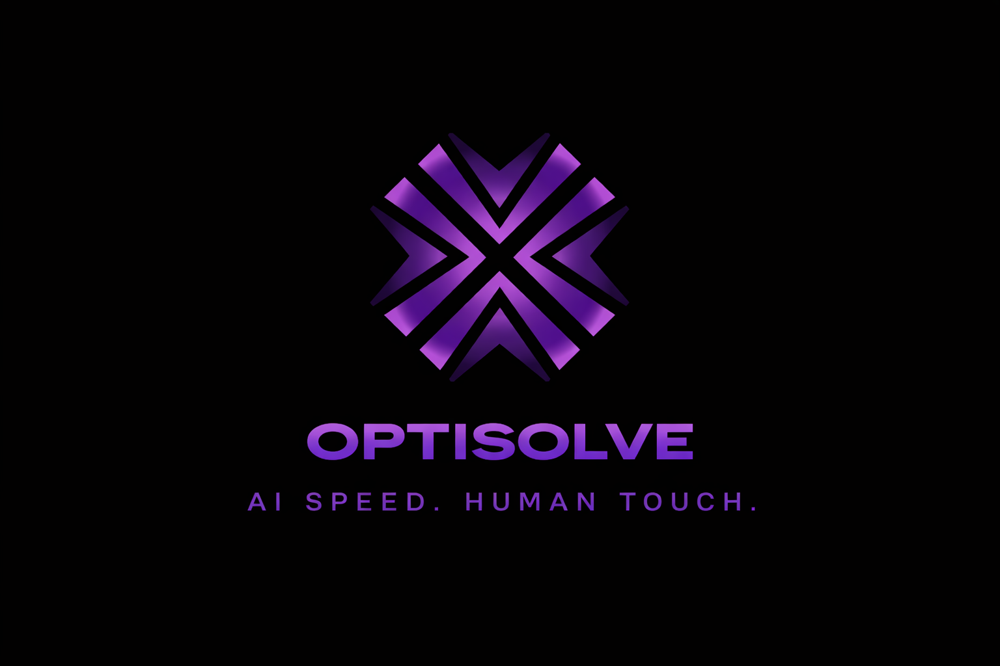

<div align="center">
  
  <h1>OptiSolve</h1>
  <p><b>AI speed. Human touch.</b></p>
  <p><i>Made by Kaveri, Jival, Inesh, Janya - Team codeforcers for ATOS SRIJAN 2026</i></p>
</div>

---

Demo video: https://drive.google.com/file/d/1ODCI-j1nPftBB69aMu3-EYH3kEsY4aDW/view?usp=sharing

## The Problem
Support teams get more tickets than they have people. Many are repeat questions that already have a known answer, while others need a human's judgement. Treating every ticket the same way means customers wait on simple issues and agents spend time retyping the same replies.

## What OptiSolve Does
OptiSolve is a support chat system that decides, per message, whether the AI should answer directly, draft a reply for a human agent, or hand the conversation straight to an agent. When agents resolve conversations, their replies are written back into the knowledge base, so similar questions later get higher confidence.

It has two views:
- **User Portal** – a customer opens a conversation and chats with support.
- **Agent Inbox** – agents see escalated conversations (with the AI's draft where one exists), reply, and mark them resolved. It also shows live counts of conversations by status.

## How a Message Is Handled

For each customer message (`POST /conversation/{id}/message`):

1. **Retrieval (RAG)** – the message is embedded with `all-MiniLM-L6-v2` (sentence-transformers, runs locally) and the top 3 matches are pulled from a ChromaDB collection using cosine distance. The collection holds both the seed entries and agent-resolved examples.
2. **Confidence score** – computed from the retrieval similarities:
   `0.75 × top + 0.25 × mean`
3. **Draft reply** – gpt-oss-120b (via Groq) writes a short plain-text reply (under 110 words, numbered steps) using the retrieved past solutions as context.
4. **Sentiment** – gpt-oss-20b (via Groq) scores the message from −1 to 1. A score of −0.7 or lower lowers confidence by 0.2.
5. **Routing** on the adjusted confidence:

| Tier | Confidence | What happens |
|---|---|---|
| 🟢 Tier 1 | ≥ 0.85 | AI reply is sent to the customer immediately. |
| 🟡 Tier 2 | 0.60 – 0.85 | Conversation moves to the Agent Inbox with the AI draft attached for the agent to review. |
| 🔴 Tier 3 | < 0.60 | Conversation moves to the Agent Inbox without a draft. |

Once a conversation is with an agent, further customer messages go to the agent, not the AI. If the customer writes again after the conversation is resolved, it reopens and goes back to the AI.

## Learning Loop

When an agent resolves a conversation (`POST /agent/conversation/{id}/resolve`):

- **Turn chunks** – each customer message and the agent reply that followed are stored in ChromaDB as a new example. If the agent reply is ≥ 85% similar to the AI's draft (difflib `SequenceMatcher`), it is skipped because it adds nothing new.
- **Conversation summary** – if the customer sent at least 2 messages, gpt-oss-120b writes a 2–3 sentence summary of the issue and fix, which is stored alongside the final agent reply.

These examples go into the same collection used for retrieval, so a repeat of a resolved question matches closely and its confidence rises (for example, from Tier 3 to Tier 1 for an exact repeat), and the agent's answer is passed to the LLM as context. The scripts in `scripts/` walk through this flow against a running server.

The knowledge base is seeded on first start with 20 common issues (password reset, 2FA, VPN, account lock, billing, refunds, subscriptions, team invites, data export, Wi-Fi, installation, updates, email, file sharing and more).

## Tech Stack

- **Frontend:** React 18, Vite, plain CSS, lucide-react icons. Polls the backend every 4 seconds for updates.
- **Backend:** Python, FastAPI, Pydantic.
- **Vector store:** ChromaDB (persisted to `./chroma_db`), sentence-transformers `all-MiniLM-L6-v2` embeddings.
- **LLMs** on Groq (called through the `openai` SDK against Groq's OpenAI-compatible endpoint):
  - `openai/gpt-oss-120b` for replies and conversation summaries
  - `openai/gpt-oss-20b` for sentiment
- **App data:** conversations and tickets are kept in memory.

## Project Structure

```
backend/
  main.py                 FastAPI app, CORS, seeds knowledge base on startup
  routes/
    conversation_routes.py  chat, agent inbox, resolve, metrics (used by the frontend)
    ticket_routes.py        single-shot ticket API (/submit-ticket, /ticket-status)
    agent_routes.py         ticket agent queue, admin view, dashboard metrics
  services/
    ai_service.py         retrieval, confidence, reply generation, learning loop
    sentiment_service.py  LLM sentiment scoring
    routing_service.py    tier thresholds
  database/               in-memory conversation and ticket stores
  utils/knowledge_base.py ChromaDB setup and seed data
frontend/                 React app (User Portal + Agent Inbox)
scripts/                  manual end-to-end checks against a running backend
```

Full API docs are available at `http://localhost:8000/docs` when the backend is running.

## Getting Started

### 1. Clone
```bash
git clone https://github.com/kaverii11/Optisolve.git
cd Optisolve
```

### 2. Backend
```bash
python -m venv .venv
source .venv/bin/activate        # Windows: .venv\Scripts\activate
pip install -r requirements.txt

cp .env.example .env             # then add your GROQ_API_KEY

python -m uvicorn backend.main:app --reload
```
The API runs at http://localhost:8000. The first start downloads the embedding model.

### 3. Frontend
In a new terminal:
```bash
cd frontend
npm install
npm run dev
```
The app runs at http://localhost:5173. To point it at a different backend, copy `frontend/.env.example` to `frontend/.env` and set `VITE_API_BASE_URL`.

### 4. (Optional) Verification scripts
With the backend running, from the repo root:
```bash
pip install requests
python scripts/phase3_verify.py        # resolves a conversation, then shows confidence rising on a repeat query
```
Set `OPTISOLVE_API_URL` if the backend isn't on `http://localhost:8000`. `scripts/phase2_verify.py` reads ChromaDB directly, so run it as `python -m scripts.phase2_verify`.

## Current Limitations

- Conversations and tickets live in memory and are lost on restart (ChromaDB data persists).
- No authentication – the username typed at login is the only identity, and agent endpoints are open.
- Retrieval, reply generation and sentiment run one after another, and a reply is generated even for Tier 3.
- If the sentiment call fails or returns invalid JSON, the message is treated as neutral.
- Groq's free tier allows about 1,000 requests a day per model and 8,000 tokens a minute. The client retries automatically when rate-limited, but sustained bursts of messages can still fail.
